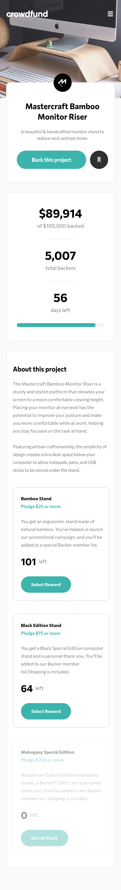
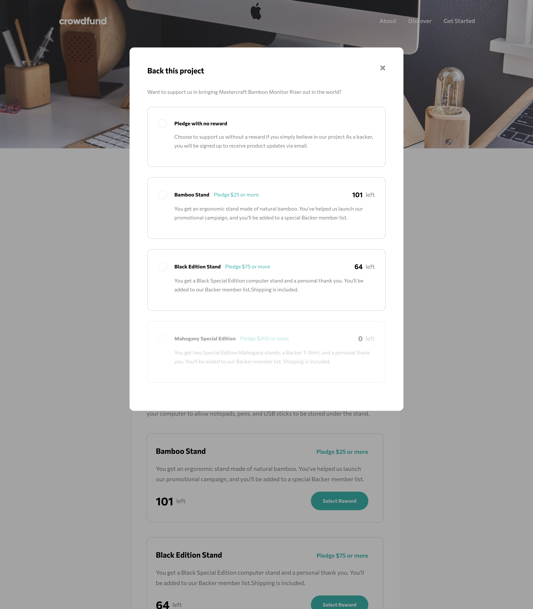

# Multipage space tourism website

Mock landing page with complex responsive grid and flex layout, the info is taken from a JSON file,

## The user can

- Make a selection of which pledge to make
- See an updated progress bar and total money raised based on their pledge total after confirming a pledge
- See the number of total backers increment by one after confirming a pledge
- Toggle whether or not the product is bookmarked
- View the optimal layout depending on their device's screen size
- See hover states for interactive elements

## 375px

.png>)

.png>)

## 1440px

.png>)

